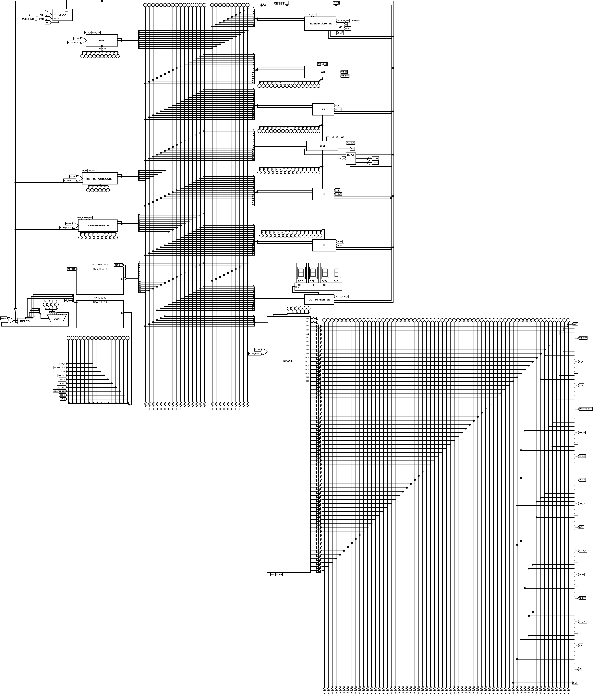

# cpu
- turing complete ben-eater like 16-bit RISC amateur CPU made in Logism Evolution
- 4-times micro-sequencer (fetch -> decode -> execute -> reset)
- 1 rom for program code and 1 rom for microcode
- 2 buses -> data and address bus
- 16 bytes ram addressable
- 64 possible instructions



# Instruction Set Architecture
- Opcode -> 6 Bit MSB (10 to 15)
- Operand -> 10 Bit LSB (0 to 9)
- DCD -> O0 (resistor/reserved)      	   | BUG 	   | NULL (0x0)
- DCD -> O1 (resistor/reserved) 		   | BUG 	   | NULL (0x0)
- DCD -> O2 (HALT) 		   	   | HLT 	   | 0x04**
- DCD -> O3 (R0_IN, RAM_OUT) 	   	   | LD R0, [addr] | 0x08**
- DCD -> O4 (R1_IN, RAM_OUT)	   	   | LD R1, [addr] | 0x0C**
- DCD -> O5 (OUTPUT_REG_IN, RAM_OUT) 	   | OUT [addr]    | 0x10**
- DCD -> O6 (R0_OUT, RAM_IN)         	   | LD [addr], R0 | 0x14**
- DCD -> O7 (R1_OUT, RAM_IN)   	   	   | LD [addr], R1 | 0x18**
- DCD -> O8 (R0_IN, OPR_OUT)  	   	   | LD R0, val	   | 0x1C**
- DCD -> O9 (R1_IN, OPR_OUT)  	   	   | LD R1, val    | 0x20**
- DCD -> O10 (JUMP, OPR_OUT) 	    	   | JMP addr      | 0x24**
- DCD -> O11 (ALU_OUT, RR_IN)  	   	   | ADD R0, R1    | 0x28**
- DCD -> O12 (ALU_OUT, SUB, RR_IN)   	   | SUB R0, R1    | 0x2C**
- DCD -> O13 (RR_OUT, RAM_IN) 	   	   | LD [addr], RR | 0x30**
- DCD -> O14 (R0_OUT, R1_OUT, SUB, FLAGS_IN) | CMP R0, R1    | 0x3400
- DCD -> O15 (JZ, FLAGS_IN, OPR_OUT)	   | JZ addr       | 0x38**
- DCD -> O16 	  			   | NOP           | 0x3C00

# Programs
```x86asm
; ---- INCREMENT_TO_OF
0x0 | 0x1C01  ; LD R0, 1
0x1 | 0x2001  ; LD R1, 1
0x2 | 0x2800  ; ADD R0, R1
0x3 | 0x3000  ; LD [0x0], RR
0x4 | 0x1000  ; OUT [0x0]
0x5 | 0x0800  ; LD R0, [0x0]
0x6 | 0x2402  ; JMP 0x2
0x6 | 0x0400  ; HLT
```
