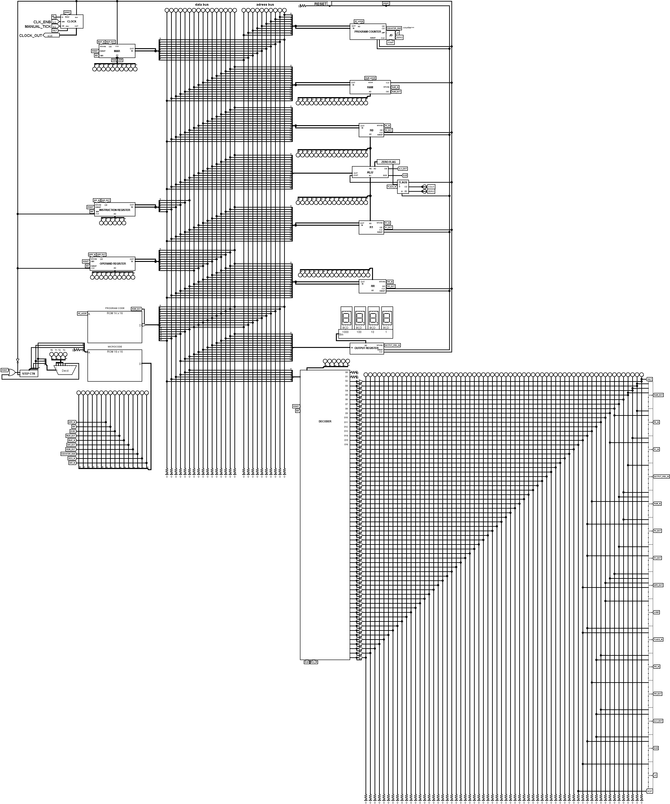

# cpu
- turing complete 16-bit harvard-like CISC CPU made in Logisim Evolution (v3.9.0)
- 3 t-stages micro-sequencer (fetch -> decode -> execute) for one-shot instructions
- +4 t-stages for multi-shot instructions
- 1 rom for program code and 2 roms for microcode
- 2 buses -> data bus and address bus
- 16 bytes addressable ram (internal memory)
- 64 possible instructions

# v1 - turing complete version
- [ISA16](source/image/v1/ISA.txt)
- [main microcode](source/data/core/MICROCODE1)

# v2 - current version
- [ISA16](source/image/v2/ISA.txt)
- [main microcode](source/data/core/MICROCODE1)
- [multi-shot microcode](source/data/core/MICROCODE2)

### Programs
- [Increment to overflow](source/data/programs/INC_TO_OF)
